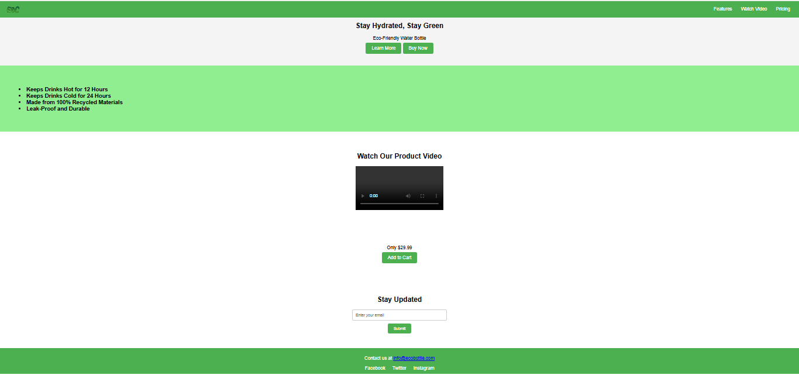

# Eco-Friendly Water Bottle - Product Landing Page

This is a **Product Landing Page** for an **Eco-Friendly Water Bottle**, designed using **HTML and CSS**. The webpage highlights the features, pricing, and a promotional video of the product.

✅ This project was created as part of a **FreeCodeCamp certification project**.

## Features
- Keeps drinks hot for **12 hours**
- Keeps drinks cold for **24 hours**
- Made from **100% recycled materials**
- **Leak-proof** and **durable** design

## Technologies Used
- **HTML** - For structuring the webpage
- **CSS** - For styling and layout

## Project Overview
This landing page includes:
- A **navigation bar** with links to different sections.
- A **hero section** with a product tagline and call-to-action buttons.
- A **features section** describing the product's benefits.
- An **embedded product video**.
- A **pricing section** with an "Add to Cart" button.
- A **subscription form** for users to stay updated.
- A **footer** with social media links.

## Preview



## How to Use
1. Clone this repository:
   ```sh
   git clone https://github.com/Roshami/Product-Landing-Page.git
